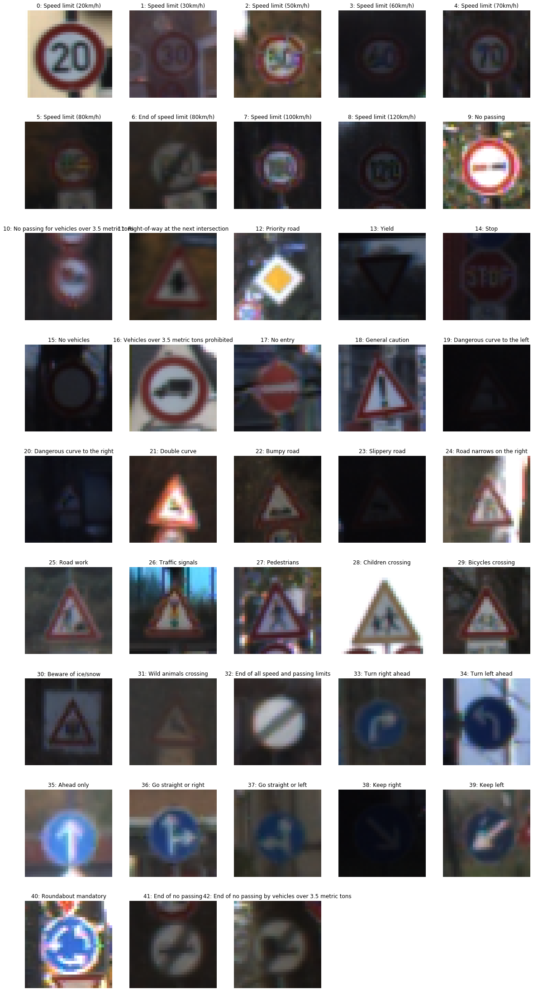
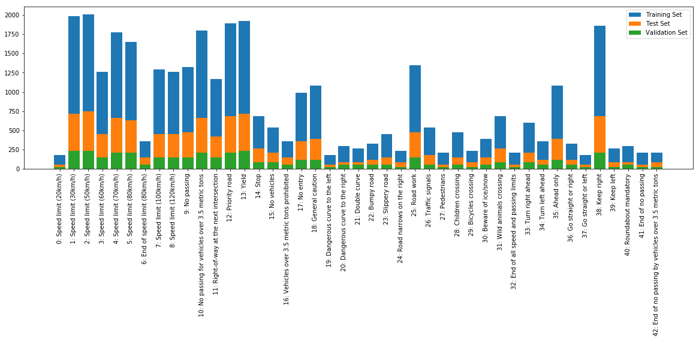
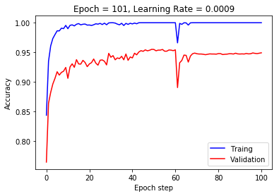
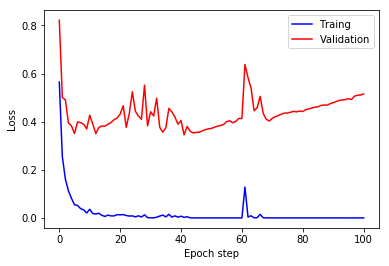
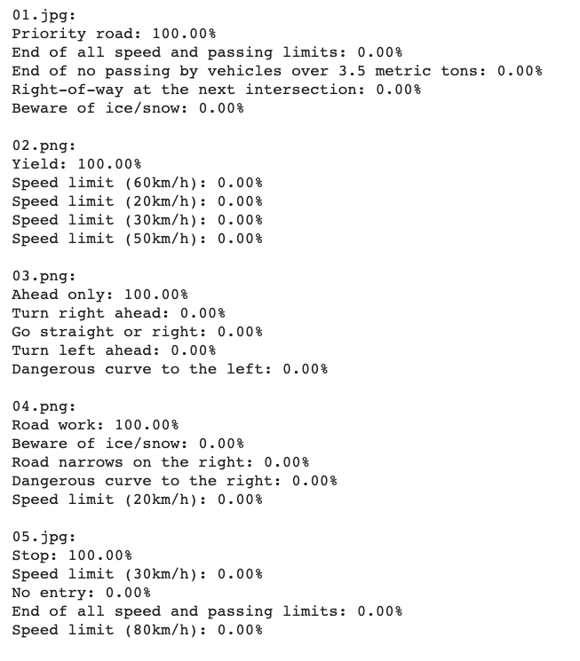

# **Traffic Sign Recognition** 

## Deep Learning

**Build a Traffic Sign Recognition Project**

The goals / steps of this project are the following:
* Load the data set (see below for links to the project data set)
* Explore, summarize and visualize the data set
* Design, train and test a model architecture
* Use the model to make predictions on new images
* Analyze the softmax probabilities of the new images
* Summarize the results with a written report

---
### Writeup / README

1. Ipython notebook with code link: https://github.com/shinyingl/SelfDrivingCar-P3/blob/master/Traffic_Sign_Classifier.ipynb
2. HTML output of the code link: https://github.com/shinyingl/SelfDrivingCar-P3/blob/master/Traffic_Sign_Classifier.html

### Data Set Summary & Exploration

#### 1. Dataset Summary
|Data Item			        |     number	        				| 
|:---------------------:|:-----------------------------------------:| 
| Training Examples     	| 34799 								| 
| Testing Examples     		| 12630									|
| Image data shape			| 32 x 32 x 3							|
| Number of classes	      	| 43					 				|

#### 2. Exploratory Visualization

Visualization of all different signs is as below:

Distribution of training data set:

### Design and Test a Model Architecture

#### 1. Preprocessing
The input images for training, test, and validation are first reduce to a resolution of 32 x 32 x 3 (RGB) to meet the LeNet model input requirement. The pixel values  are normalized from 0 ~ 255 to -1 ~ +1 (GL = (GL-128)/128 for all 3 channels). This is to make the pixel values distribution to be centered at 0.

#### 2. Model Architecture

LeNet architecture is used in the deep learning model:

| Layer         		|     Matrix dimension        				    	| 
|:---------------------:|:---------------------------------------------:| 
| Input         		| 32 x 32 x 3 RGB image   							| 
| Convolution (conv1)  	| 1x1 stride, same padding, outputs 28 x 28 x 6  	|
| Max pooling (pool1)   	| 2x2 stride,  outputs 14 x 14 x 6 				|
| Convolution (cov2)	    | 1x1 stride, same padding, outputs 10 x 10 x 16 |
| Max pooling (pool2)		| 2x2 stride,  outputs 5 x 5 x 16         		|
| Fully connected (layer3~5)				| outputs 120 --> 84 --> 43        			|
| Softmax						|												|

 

#### 3. Model Training
| Training          	|     Description        				    	| 
|:---------------------:|:---------------------------------------------:| 
| Optimizer     		| Adam   							| 
| Batch Size  	| 	128 |
| Epocs #   	| 	51 			|
| Learning Rate |   0.0009	| 

#### 4. Solutaion approach 

- LeNet model architecture + ReLU activation is chosen for traffic sign classifer project. LeNet is a classical architecture for pattern recongition. Before Lenet model, most pattern reconfition systems used a combination of automatic learning techneqiques and hand-crafted algorithms. LeNet learns the internal representation from raw images automatically. [1] LeNet is simple and provides good accuracy for this project. ReLU is used to prevent saturation and faster convergence in gradient decent.  

- Adam opimizer is used because it provides good computational efficiency. [2]

- A large Epocs is chosen to first overfit the model, then the final Epcs step is chosen to be 51 because it provides good model accuracy and hte loss is saturated. 

- The Epocs and Learning rate are chosen by observing where accuracy and loss start to saturate in the below figures.
		
	
	
- Learning Rate = 0.0009 is used becuse it provides a good convergence curve with a reasonable Epocs of 51.
 
- The final model results are:

| Data Set       	|    Accuracy     				    	| 
|:---------------------:|:---------------------------------------------:| 
| Training Set    		| 100%  							| 
| Validation Set 	| 	93.8% |
| Test Set 	| 	93.0%			

### Test a Model on New Images

#### 1. Acquiring New Images

Here are five German traffic signs found from web search. All the images are pre-processed to 32 x 32 x 3.
They are chosen in order to check if the model can clasify traffic signs with different shape, color, and text/ symbol representations.

#### 2. Performance on the New Images

Here are the results of the prediction:

|Image No| Image			        |     Prediction	        					| 
|:------:|:---------------------:|:---------------------------------------------:| 
|01.jpg| 12: Priority road     		| 12: Priority road   									| 
|02.png| 13: Yield    					| 13: Yield 										|
|03.png|  35: Ahead only				| 35: Ahead only											|
|04.png| 30: Beware of ice/snow	   	| 25: Road work					 				|
|05.png| 14: Stop 				| 14: Stop      							|

The model was able to correctly guess 4 of the 5 traffic signs, which gives an accuracy of 80%. 

#### 3. Model Certainty - Softmax Probabilities

#### [Optional] Visualizing the Neural Network 
After conv1: 14x14x6

After sub-sampling with max pooling :14x14x6

After conv2: 10x10x16

After conv2 and sub-sampling with max pooling : 5x5x16

#### Reference
##### 1. Yann LeCun et. al. "Gradient-Based Learning Applied to Documentation Recongition" (http://vision.stanford.edu/cs598_spring07/papers/Lecun98.pdf)
##### 2.Diederik P. Kingma and Jimmy Lei Ba, "Adam: A Method for Stochastic Optimization" (https://arxiv.org/abs/1412.6980) 
